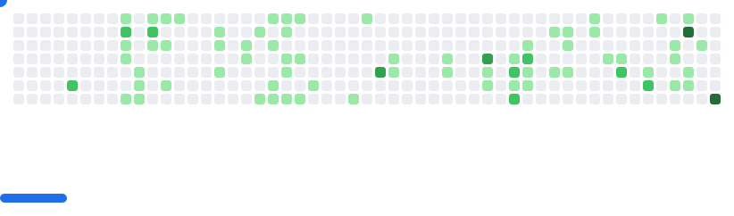

  

<h1 align="center" style="line-height: 1.4;">
  Hi there
  
   I'm 
    
  
</h1>

  
  

---

## 👨‍💻 About Me  

  <strong>I'm Mehedi Hasan Tanjil</strong>, a full-stack developer specializing in the MERN stack from Dhaka, Bangladesh.

  
I craft <strong>end-to-end</strong> web applications using MongoDB, Express.js, React, and Node.js, focusing on seamless user experiences and robust backend architectures.  
Currently mastering **advanced React patterns** and **scalable backend solutions** while building projects that solve real-world problems.  
Passionate about writing **clean, maintainable code** and creating applications that are both powerful and intuitive.  

 🚀 Always exploring new technologies and eager to collaborate on impactful full-stack projects.  

---

## 📊 GitHub Highlights  

<picture>
  <source media="(prefers-color-scheme: dark)" srcset="images/breakout-dark.svg" />
  <source media="(prefers-color-scheme: light)" srcset="images/breakout-light.svg" />
  
</picture>

  

  

  

---

## 🚀 Featured Projects  

  <!-- Replace with your project pins -->
  *Projects coming soon!*

Check out my repositories where I solve interesting problems and learn new technologies.  

---

## 💻 Tech Stack & Skills

<!-- Animated Tech Stack -->

<b>🎯 Click to see detailed tech breakdown</b>

 

<table align="center">
  <tr>
    <td align="center" width="50%">
      
### 🖥️ Frontend Technologies

    
      
### ⚙️ Backend & Database

### 🛠️ Tools & Platforms

   
  </tr>
</table>

---
## 📚 Learning Journey & Goals

  <table>
    <tr>
      <td align="center">
        
      </td>
      <td align="center">
        
      </td>
    </tr>
    <tr>
      <td align="center">
        
      </td>
      <td align="center">
        
      </td>
    </tr>
    <tr>
      <td align="center" colspan="2">
        
      </td>
    </tr>
  </table>

  <h4>🛠️ MERN Stack Focus Areas:</h4>
  

    
    
    
    
  

---

## 🤝 Let's Connect & Collaborate

   
  <strong>Ready to build something amazing together?</strong> 
  

  <table>
    <tr>
      <td align="center">
        
      </td>
      <td align="center">
        
      </td>
    </tr>
    <tr>
      <td align="center">
        
      </td>
      <td align="center">
        
      </td>
    </tr>
  </table>

  <h3>💬 Ask me about:</h3>
  

    
    
    
    
    
    
    
    
  

---

  <table>
    <tr>
      <td align="center">
        
      </td>
      <td align="center">
        
      </td>
    </tr>
  </table>

  

---
